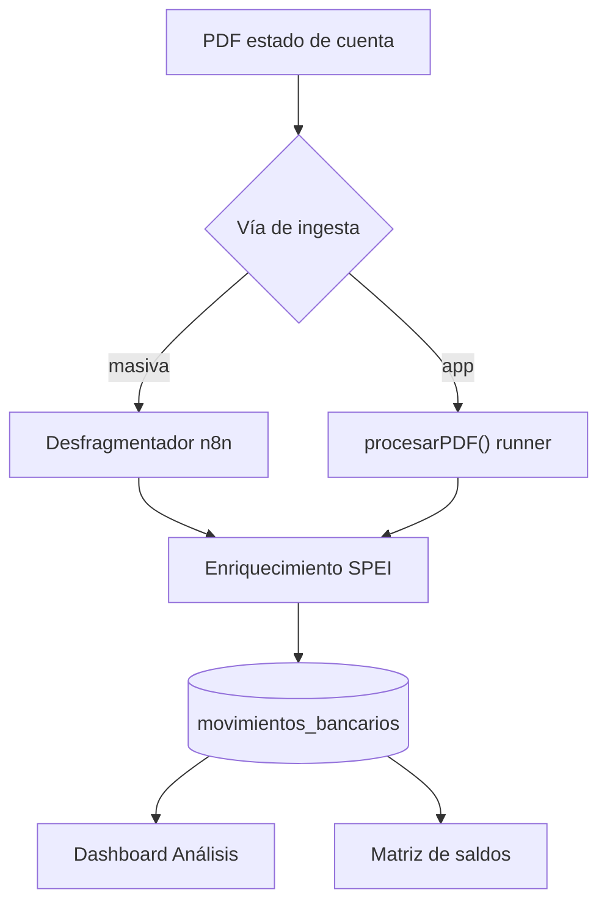

---

tags: [tesoreria, algoritmo, estados-de-cuenta]

banco: movimientos_bancarios

actualizado: 2026-07-06

---
---

tags: [tesoreria, algoritmo, estados-de-cuenta]

banco: movimientos_bancarios

actualizado: 2026-07-06

---

  

# Algoritmo de análisis de estados de cuenta

  

Flujo end-to-end: desde que llega un PDF de estado de cuenta hasta que aparece en el dashboard de Análisis y en la matriz de saldos.

  

> [!info] Dos vías de ingesta, una sola tabla

> Todo converge en `movimientos_bancarios`.

> - **Vía masiva / histórica:** workflow **n8n** (los nodos "Code" están respaldados en `reprocesar db/desfragmentador_nodes/00..13`).

> - **Vía app (interactiva):** endpoints `/api/analisis/pdf-preview` y `/pdf-guardar`, que llaman a `procesarPDF()` de `backend/lib/desfragmentador/runner.js` — un *port* de esos nodos.

  

> [!warning] El runner no está en git

> `backend/lib/desfragmentador/runner.js` se importa en `backend/routes/analisis.js:8` pero **no existe** en el working tree ni en git. Probablemente vive solo en el server desplegado (patrón surgical-deploy). Su algoritmo conceptual es el de los nodos 01–13.

  



  

---

  

## 1. Ingesta / captura del PDF

  

Tres superficies. Solo `analisis.js` **procesa** PDFs; `bancos.js`/`cuentas.js` solo los **sirven**.

  

| Acción | Endpoint | Archivo |

|---|---|---|

| Preview (no escribe DB) | `POST /api/analisis/pdf-preview` | `analisis.js:1927` |

| Guardar (INSERT) | `POST /api/analisis/pdf-guardar` | `analisis.js:1999` |

| Servir PDF guardado | `GET /api/bancos/pdf/*` | `bancos.js:24` |

| Layout Excel (no PDF) | `POST /validar-layout` · `/importar-layout` | `captura.js:914` · `1000` |

| Movimiento manual suelto | `POST /movimiento` | `captura.js:1184` |

  

- **`pdf-preview`**: recibe `{ pdf_base64, file_name }`, decodifica a Buffer, llama `procesarPDF()` y devuelve banco / empresa / fecha_reporte / saldo_corte / movimientos **sin escribir en DB**. Sugiere `empresa_id`/`banco_id` contra catálogos AUD (`analisis.js:1942-1969`).

- **`pdf-guardar`**: reprocesa con el `bancoOverride` que confirma la UI, guarda el PDF físico en `UPLOADS_PATH/<idCarga>/<nombre>` y hace el INSERT transaccional (→ paso 4).

  

---

  

## 2. Desfragmentador

  

Motor que reconstruye movimientos partidos en varias líneas del OCR y los estructura. Nodos en `reprocesar db/desfragmentador_nodes/` (inventario y conexiones en `_README.md`). Orden **lógico**:

  

1. **`09_DETECTAR_BANCO_X_NOMBRE`** — limpia texto (NBSP, saltos, espacios) y **detecta el banco** por nombre de archivo + contenido, agrupando por banco.

2. **`10_desfragmentador1`** / **`13_desfragmentador`** — motor "DESFRAGMENTADOR v3.8.1 (Fail-Safe)". Reconstruye movimientos multilínea. `13` es la rama **NO-BBVA** (BBVA se rutea aparte por el nodo "es bbva?"). Catálogo de empresas embebido + `buscaEmpresaCorto` (exacta → parcial → difusa Dice ≥ 0.85).

3. **`11_empaquetado_de_movimientos`** — empaqueta en la estructura de salida: `movimientos` / `comisiones` / `otros_cargos` + encabezado (archivo, empresa, banco, fecha_reporte, saldos).

4. **`02_movimientos-excel`** — aplana y **unifica** las tres listas etiquetando cada fila con `catalogo` = `movimiento` | `comision` | `otros_cargos`.

5. **`03_formato-fecha`** — normaliza fechas ES (`ENE..DIC`), `dd-MMM-yy` → canónica, valida día máximo del mes.

6. **`05_generar_UUID_valores_null`** — **un solo `cargaUUID` (= id_carga) para toda la carga**, importes a valor absoluto, fechas DD/MM/YYYY en hora local (evita off-by-one UTC-6).

7. **`06_clasificacion`** — clasifica por prioridad de reglas. Catálogo:

  

   | id | clasificación | id | clasificación |

   |---|---|---|---|

   | 1 | PAGO_SERVICIO | 6 | DESCONOCIDO |

   | 2 | DEPOSITO_CLIENTE | 7 | NOMINA |

   | 3 | TRANSFERENCIA_TERCEROS | 8 | NA |

   | 4 | COMISION | 9 | DEVOLUCION_CANCELACION |

   | 5 | AJUSTE_BANCARIO | 10 | SUA |

  

   Regla 0: CFE → PAGO_SERVICIO.

8. **`07_limpieza`** — valida campos obligatorios, **homologa empresas** contra catálogo AUD, normaliza bancos/fechas; inválidos → marcados en `error`.

9. **`08_limpieza_preparar_salida`** — "HEADER ONLY": lee saldos **exclusivamente de `movimientos.totales_pdf`** y detecta conciliación (✅/❌).

  

Salida → nodos Postgres "insertar movimientos" y "actualizar saldos dashboard".

  

---

  

## 3. Enriquecimiento SPEI — `backend/lib/extraer_spei.js`

  

Extrae campos SPEI desde la **descripción** del movimiento. Entrada: `parsearMovimiento(mov, opts)` (`extraer_spei.js:635`).

  

> [!important] No adivina el banco desde el texto

> `switch` sobre `mov.banco` ya asignado (`:643-654`) → `parseBBVA`, `parseBanregio`, `parseBanbajio`, `parseBanorte`, `parseMultiva`, `parseBxMas`, `parseSantander`, `parseAfirme`, `parseKuspit` o `parseGenerico`. El nombre se normaliza vía `ALIAS_BANCO` (`BBVA BANCOMER→BBVA`, `VE POR MAS→BX+`).

  

- **Signo / dirección**: cada parser mira marcadores (`SPEI ENVIADO`/`RECIBIDO`, `ENVIADO A`/`RECIBIDO DE`…). Fallback: `retiro>0 → beneficiario`, `deposito>0 → ordenante`. Empresa titular: en retiro es **ordenante**, en depósito es **beneficiario** (`:662-671`).

- **CLABE**: `extraerClabe` (`:80`) toma 18 dígitos (BBVA "00+CLABE" de 20 → recorta a 18). Se **valida** con dígito de control Banxico (`validateClabe`) para no confundir referencias de pago de servicio con CLABE.

- **Beneficiario/Ordenante**: `limpiarNombre` (`:48`) quita BNET/FT, números largos, fechas, RFC, paréntesis. Fallback por **CLABE conocida** vía `clabeLookup` Map (nombre más frecuente por CLABE + directorio canónico).

- **Concepto / clave_rastreo**: patrones por banco; rastreo genérico BNET/FT/APR. Universal: `RAS` y `CONVENIO` para CONCENTRACION/CFE.

- **`opts.soloNulos` (default true)**: solo rellena campos vacíos o "sucios" (`esSucio`), sin pisar lo ya extraído.

  

---

  

## 4. Inserción en `movimientos_bancarios`

  

Tres rutas de INSERT, misma tabla. Campos pivote:

  

| Campo | Significado |

|---|---|

| **`id_carga`** | `randomUUID()` por PDF (`analisis.js:2045`). Agrupa todos los movimientos de un estado. **Pivote del cálculo de saldos.** |

| **`empresa_corto`** | override homologado de la UI |

| **`fuente`** | `'banco'` (PDF app) vs `'manual'` (captura) |

| **`fecha_reporte`** | fecha del **corte** del estado |

| **`fecha`** | fecha del **movimiento** individual |

| **`saldo`** | saldo corrido de la línea (nullable) |

| **`catalogo`** | `movimiento` / `comision` / `otros_cargos` |

  

> [!tip] El mes siempre se ubica con `COALESCE(fecha_reporte, fecha)`

> Todos los tableros usan ese COALESCE para asignar mes.

  

- **PDF app** (`analisis.js:2110`): antes del INSERT re-enriquece con `parsearMovimiento(..., {soloNulos:true})` y corrige CLABE inválida.

- **Layout Excel** (`captura.js:1102`): `movimiento_id = MAX+1` dentro de `(empresa_corto, banco_id, fecha_reporte)` para **desempate determinista** del saldo de cierre.

  

**Homologación — `backend/utils/homologacion.js`:**

- `normalizarEmpresaCorto()` (`:248`): mapa O(1) `variante → corto canónico` (razones sociales → `ALAMINA`, `AILEC`, `HEAV STEEL`…).

- `normalizarBancoKey()` (`:279`): primera regla regex que casa gana, por prioridad.

- `norm()` (`:234`): mayúsculas + sin acentos + trim.

  

Estas funciones se reusan en el dashboard para **re-agregar** filas que colapsan a la misma empresa/banco.

  

---

  

## 5. Dashboard de Análisis — `backend/routes/analisis.js`

  

| Endpoint | Qué calcula |

|---|---|

| `GET /heatmap` (`:96`) | Mapa de calor empresa × mes: ¿hay estado cargado? Filtra bancos activos por periodo AUD. |

| `GET /heatmap-detalle` (`:321`) | Detalle por empresa/mes: archivos, `id_carga`, métricas, inconsistencias (faltan/sobran estados). |

| `GET /proyecciones` (`:547`) | Saldo cierre por empresa+moneda (últimos 8 meses, `DISTINCT ON (id_carga)`) → **regresión lineal** + proyección 3 meses. USD→MXN con FIX Banxico. Tendencia alza/baja/estable. |

| `GET /desglose` (`:666`) | Por concepto/clasificación, top comisiones, por frontal, por proveedor. |

| `GET /calendario` (`:846`) | Por día de semana; pagos normales vs raros (sábado/domingo); días calientes; por tesorero. |

| `GET /actividad` (`:1089`) | Actividad por tesorero con desglose por empresa, día y semana. |

  

Auxiliares: `DELETE /carga/:id_carga` (`:510`), `DELETE /periodo` (`:525`), `POST /completar-faltantes-cero` (`:1359`), `GET /cobertura-pdf` (`:1615`).

  

---

  

## 6. Matriz de saldos empresa × mes

  

Vive en `backend/routes/cuentas.js:41` — `GET /api/cuentas/matriz?anio=`. Casi todo el algoritmo es **un solo SQL** (`cuentas.js:64-139`):

  

1. **`saldo_carga`** (`:65`): `DISTINCT ON (id_carga)` → un saldo por estado = el del **último movimiento** de esa carga (orden `fecha DESC, movimiento_id DESC, id DESC`). Aquí importa el `movimiento_id` determinista.

2. **`saldo_fin_mes`** (`:82`): `DISTINCT ON (empresa, banco, moneda, ym)` → colapsa cargas duplicadas del mismo mes al **último** saldo (no las suma).

3. **`cuentas`** (`:90`): universo de cuentas con cualquier saldo histórico (incluye dormidas).

4. **`meses` + `relleno`** (`:94`): **carry-forward** — para cada cuenta × mes toma el último saldo conocido con `ym <= fin de ese mes`.

  

> [!caution] Excepción del mes en curso

> Para el año/mes actual **no hay arrastre**: exige saldo fechado exactamente en ese mes. Sin estado de cuenta → queda NULL (`cuentas.js:108-112`).

  

5. **Pivote** a columnas `ene..dic` con `MAX(CASE WHEN m=…)`.

  

Post-proceso en Node:

- **Re-agregación por homologación** (`:170-186`): `normalizarEmpresaCorto`/`normalizarBancoKey` fusionan filas que colapsan a la misma clave `empresa||banco||moneda`, sumando meses.

- **Corte de canceladas** (`:141-232`): cruza AUD `empresa_bancos_log` (`BOOL_AND(fecha_fin IS NOT NULL)` = cancelada). Las canceladas **conservan** su saldo arrastrado, solo se marcan `cancelada`/`fecha_cancelacion`. Cuentas AUD sin movimientos → `sin_datos:true`.

  

> [!note] Un solo criterio de saldo en todo el sistema

> "Último saldo por carga" se replica en proyecciones (`analisis.js:556`), Matriz Global de Bancos (`bancos.js:123`) y haberes (`haberes.js:25`) para que todos los tableros cuadren.

  

---

  

## 7. Datos de extracción por banco — `extraer_spei.js`

  

Cada parser recibe la `descripcion` (texto del movimiento) y devuelve solo los campos que logra extraer. **El banco no se adivina del texto**: se despacha por `mov.banco` ya asignado. El signo (retiro/depósito) sale de marcadores de texto y, como fallback, de `retiro>0`/`deposito>0`.

  

### BBVA — `parseBBVA` (`:107`)

- **Formato:** `T1n SPEI ENVIADO {banco} … {ddmmyy} {concepto} Ref. {ref} … {clabe20} {rastreo} BNET… {nombre}` · `T2n SPEI RECIBIDO …`

- **Dirección:** `SPEI ENVIADO`→beneficiario · `SPEI RECIBIDO`→ordenante (fallback retiro/depósito).

- **CLABE:** 18 díg, o 20 díg (`00`+CLABE18 → recorta). **Rastreo:** `BNET…` → `…APR…`.

- **Extrae:** `banco_clabe`, `concepto`, `referencia`, `clabe`, `clave_rastreo`, `beneficiario`/`ordenante`, `tipo_movimiento`.

  

### BANREGIO — `parseBanregio` (`:165`)  ·  3 subformatos + CSV

- **Inbound:** `INT {rastreo}-{code} SPEI, <csv>`  ·  **Outbound:** `TRA SPEI-{ref} SPEI, <csv>`  ·  **FT:** `FT{code} SPEI {RECIBIDO|ENVIADO} {banco} {clabe18} {nombre} REF: … RASTREO: …`

- **CSV (split por coma):** `0=banco · 1=clabe18 · 2=nombre · 3=rastreo canónico · 4=referencia · 5+=concepto`. Parse por split (no regex fija) para no perder nombre en CSV corto.

- **Pago de servicio:** `TRA {folio}-Pago de servicio` → el folio es `referencia`, **no** CLABE. **Recepción de cuenta** → `cuenta`. La CLABE genérica se **valida** (dígito Banxico) antes de aceptarse.

- **Dirección:** retiro → beneficiario=contraparte, ordenante=empresa; depósito al revés.

  

### BANBAJIO — `parseBanbajio` (`:240`)  ·  3 plantillas

- **Envío:** `ENVÍO SPEI:{concepto}(BI-…) INSTITUCIÓN RECEPTORA:{banco} BENEFICIARIO:{nombre}`

- **Depósito:** `DEPÓSITO SPEI:{concepto} INSTITUCIÓN EMISORA:{banco} ORDENANTE:{nombre} CUENTA ORDENANTE:{clabe} REFERENCIA:{rastreo}`

- **Recibido:** `Institucion contraparte:{banco} Ordenante:{nombre} Cuenta:{clabe} Clave de rastreo:{cr} Concepto:{…}`

- **Extrae:** `concepto`, `banco_clabe`, `beneficiario`/`ordenante`, `clabe`, `clave_rastreo`.

  

### BANORTE — `parseBanorte` (`:286`)

- **TEF:** `TEF BCO:{code} {nombre} CTA/CLABE {18} … CVE.RASTREO:{cr} RFC:{rfc}`

- **SPEI:** `SPEI ENVIADO/RECIBIDO {banco} …` con `CVE RAST:`/`RASTREO:`/`BNET`/`APR`.

- **CONCENTRACION CFE:** el número largo es **RAS + convenio, no CLABE** → no extrae CLABE. CLABE preferida: explícita `DE LA CLABE {18}`, si no, genérica **validada**.

  

### MULTIVA — `parseMultiva` (`:348`)

- **Formato:** `SPEI ENVIADO {banco} {clabe18} {nombre} IVA ACREDITABLE:{monto} REF:{ref} RASTREO:{cr} {concepto}`.

- Nombre se corta antes de `IVA`/`REF:`/`RASTREO:`. Rastreo desde `RASTREO:` (no del monto ACREDITABLE).

  

### BX+ — `parseBxMas` (`:381`)

- El PDF usa `". "` como salto de línea → se normaliza primero.

- **Formato:** `… BANCO {x} CUENTA:/CTA ORDENANTE:{clabe18} CONCEPTO:{…} REFERENCIA:{ref} ORDENANTE:/BENEFICIARIO:{nombre} CLAVE RASTREO:{cr}` · rastreo también desde `FT…`.

  

### SANTANDER — `parseSantander` (`:425`)  ·  el más rico

- **SPEI enviado:** `… ENVIADO A {banco} A LA CUENTA {clabe18} … AL CLIENTE {nombre} CLAVE DE RASTREO {cr}` → beneficiario=cliente, ordenante=empresa.

- **SPEI recibido:** `… RECIBIDO DE {banco} DE LA CUENTA {clabe18} … DEL CLIENTE {nombre}` → ordenante=cliente, beneficiario=empresa.

- **~10 patrones no-SPEI** que mapean la contraparte a una entidad fija: `IMSS`, `PAGO VIVIENDA RCV`→INFONAVIT, `RETENCION ISR`/`IMPTO FED`→SAT, comisiones/membresía/prima seguro→SANTANDER, `CARGO PAGO NOMINA`→NOMINA, apertura/compensación/intereses→SANTANDER. En todos, la empresa titular queda del lado correcto según retiro/depósito.

  

### AFIRME — `parseAfirme` (`:563`)

- **Formato:** `SPEI RECIBIDO DE {code}-{banco} {ref} CUENTA:{clabe18} EMISOR:{nombre} RFC EMISOR:{rfc}` con `CVE RASTREO`/`APR`/`BNET`.

  

### KUSPIT — `parseKuspit` (`:583`)

- Fondo de inversión, formato muy variable → solo `clabe`, `clave_rastreo` y `banco_clabe` (primer banco mencionado).

  

### Genérico — `parseGenerico` (`:594`)

- Fallback para bancos sin parser. Exige que el texto contenga `SPEI`; extrae `clabe`, `clave_rastreo` y nombre tras `BNET…`.

  

> [!abstract] Reglas universales (todos los bancos)  ·  `parsearMovimiento` (`:635`)

> - **RAS / CONVENIO** (`:656-660`): en `PAGO CONCENTRACION`/CFE extrae `RAS {10-30 díg}` y el convenio largo (30-40 díg).

> - **Lado propio** (`:662-671`): retiro → `ordenante`=empresa · depósito → `beneficiario`=empresa (si el parser no lo puso).

> - **`clabeLookup`** (`:679-688`): si hay CLABE pero no nombre, lo resuelve por el Map CLABE→nombre (`cargarClabeLookup` `:714`: nombre más frecuente por CLABE + override del directorio canónico confirmado).

> - **`soloNulos`** (default true, `:691`): solo rellena campos vacíos o "sucios" (`esSucio` `:743`: placeholder `SIN_EMPRESA`, códigos BNET/FT, dígitos largos, >120 chars, o rastreo que es solo referencia numérica).

  

### Auxiliares de detección

- `normBanco` + `ALIAS_BANCO` (`:24-45`): homologa nombre de banco (`BBVA BANCOMER→BBVA`, `VE POR MAS→BX+`, `IXE→BANORTE`…).

- `limpiarNombre` (`:48`): quita BNET/FT, números largos, fechas, RFC, paréntesis; rechaza códigos disfrazados de nombre.

- `extraerClabe` (`:80`) / `extraerCR` (`:90`) / `detectarTipo` (`:612`): CLABE, clave de rastreo y `tipo_movimiento` genéricos.

  

---

  

## 8. Dónde se guardan los campos — tabla `movimientos_bancarios`

  

Esquema en `reprocesar db/schema_tesoreria.sql:546`. PK = `id uuid`. Columnas y de dónde salen:

  

| Columna | Tipo | Origen |

|---|---|---|

| `id` | uuid PK | `gen_random_uuid()` (una por fila) |

| `id_carga` | uuid | `randomUUID()` por PDF — **agrupa el estado de cuenta** |

| `archivo` | text | nombre del PDF/layout |

| `banco` · `banco_id` | text · int | override confirmado en UI + catálogo |

| `empresa` · `empresa_corto` · `empresa_id` | text · text · int | homologado (`homologacion.js`) |

| `fecha_reporte` | date | corte del estado (NOT NULL) |

| `fecha` | date | fecha del movimiento |

| `movimiento_id` | int | orden dentro del estado (desempate del saldo de cierre) |

| `retiro` · `deposito` · `saldo` | numeric | importes; `saldo` = saldo corrido (nullable) |

| `moneda` | varchar | `MXN` por defecto |

| `descripcion` | text | texto crudo del PDF (fuente del parser) |

| `beneficiario` · `ordenante` | text | parser SPEI |

| `clabe` · `cuenta` · `clabe_valida` | text · text · bool | parser (CLABE validada) |

| `banco_clabe` | text | banco de la contraparte (del texto) |

| `referencia` · `clave_rastreo` · `ras` · `convenio` | text | parser |

| `concepto` | text | parser |

| `tipo_movimiento` | text | `SPEI`/`COMISION`/`CHEQUE`… (`detectarTipo`) |

| `catalogo` | text | `movimiento` / `comision` / `otros_cargos` |

| `clasificacion` · `clasificacion_id` | text · int | clasificador (default `6`=DESCONOCIDO) |

| `fuente` | varchar | `banco` (PDF) / `manual` (captura) |

| `detalles_spei` | jsonb | payload SPEI opcional (índice GIN) |

| `creado_en` · `fecha_limpieza` | timestamp | auditoría |

  

**INSERT (PDF app):** `analisis.js:2110-2147` — 27 columnas, `fuente='banco'`, `catalogo='movimiento'` fijos. Antes del INSERT re-enriquece con `parsearMovimiento({soloNulos:true})` y corrige CLABE inválida (`:2082-2108`).

Otras rutas de escritura: layout Excel (`captura.js:1102`, calcula `movimiento_id = MAX+1`) y movimiento manual (`captura.js:1238`).

  

**Índices** (`schema_tesoreria.sql:587-595`): `clabe`, `beneficiario`, `fecha`, `(empresa_id, fecha)`, `empresa_id`, `fuente`, GIN sobre `detalles_spei`.

  

---

  

## 9. Cómo se usa la base de datos

  

**Escritura** — INSERT transaccional (`analisis.js:2075` `BEGIN`…`COMMIT`, `ROLLBACK` si falla). Un `id_carga` por PDF agrupa todas las filas; el PDF físico se guarda aparte en `UPLOADS_PATH/<id_carga>/`.

  

**Lectura — el patrón clave: "último saldo por carga".** El saldo de cierre de un estado = saldo del **último movimiento** de su `id_carga`:

```sql

DISTINCT ON (id_carga) … ORDER BY id_carga, fecha DESC, movimiento_id DESC, id DESC

```

Por eso `movimiento_id` debe ser determinista. Este mismo criterio se replica en **matriz** (`cuentas.js:65`), **proyecciones** (`analisis.js:556`), **Matriz Global de Bancos** (`bancos.js:123`) y **haberes** (`haberes.js:25`) para que todos los tableros cuadren.

  

**Agregaciones del dashboard** (`analisis.js`): casi todo se resuelve en SQL —

`COALESCE(fecha_reporte, fecha)` para ubicar el mes, `SUM(retiro/deposito)`, `COUNT(DISTINCT id_carga)` para contar estados, `EXTRACT(DOW/DAY/MONTH …)` para calendario. El JOIN a `catalogo_bancos` da el nombre canónico; los periodos de alta/baja salen de la DB **AUD** (`empresa_bancos_log`).

  

**Carry-forward de saldos** (matriz, `cuentas.js:94-115`): para cada cuenta×mes toma el último saldo con `ym <= fin de mes` (arrastra el conocido). Excepción: mes en curso sin arrastre.

  

**Enriquecimiento diferido:** `cargarClabeLookup(db)` (`extraer_spei.js:714`) construye el Map CLABE→nombre desde la propia tabla (`DISTINCT ON (clabe)` por frecuencia) + `directorio_clabe_entidad`. Alimenta el fallback de nombres tanto en ingesta como en reprocesos/backfill.

  

**Borrado:** por carga (`DELETE /carga/:id_carga`) o por periodo empresa/banco/mes (`DELETE /periodo`).

  

---

  

## Resumen en una línea

  

`PDF → desfragmentador (n8n / runner) → enriquecimiento SPEI (extraer_spei) → INSERT en movimientos_bancarios con id_carga + fecha_reporte/fecha + saldo, homologando empresa/banco → dashboard (heatmap, proyecciones, desglose, calendario) + matriz de saldos con carry-forward y corte de canceladas.`